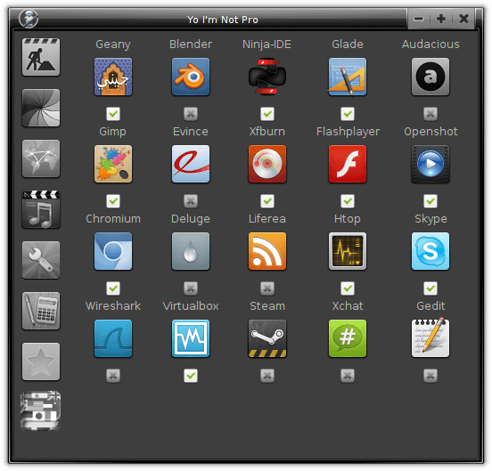

Yo I'm Not Pro
=====
 
Small application center separated on categories for archlinux/based distros. At this stage, it have 90 predefined applications.
The program checks whether those program exists and will display appropriate image - X not installed, Mark sign means installed. If the program is not installed by clicking X it will install it, if you click again it will remove it. There are tooltip text, just hover your mouse over the wanted application icon or it's install/remove button to see those texts in action.

I was inspired by Zorin OS and GNOME 3 to create this program.
## Archlinux support
Archlinux users can install the program directly from AUR, without the need to download it from here.

    yaourt -S yoimnotpro

## Requirements

* python2
* python2-gobject
* webkitgtk
* pywebkitgtk
* gnome-themes-standard  (set Adwaita theme after that)
* gtk-engines